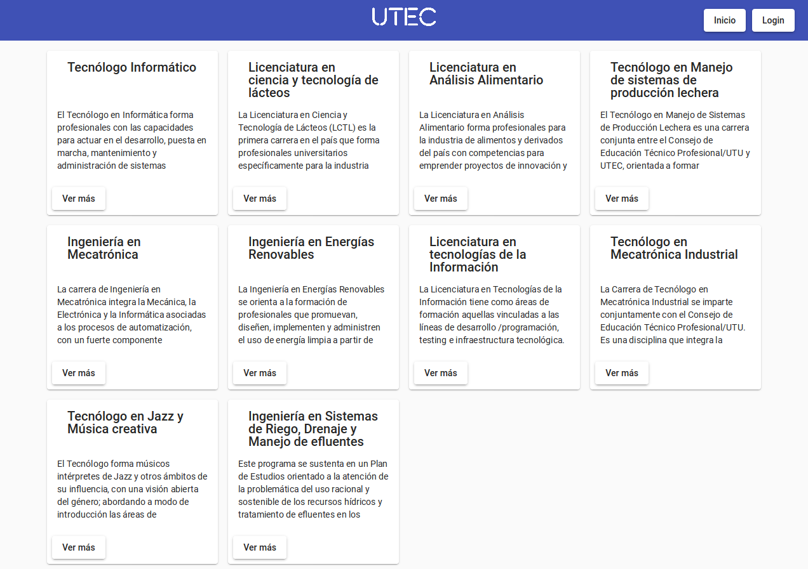
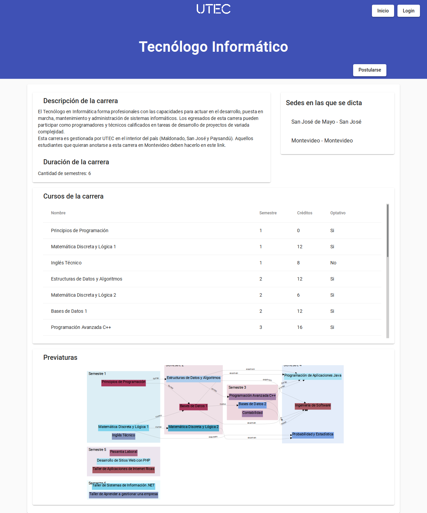
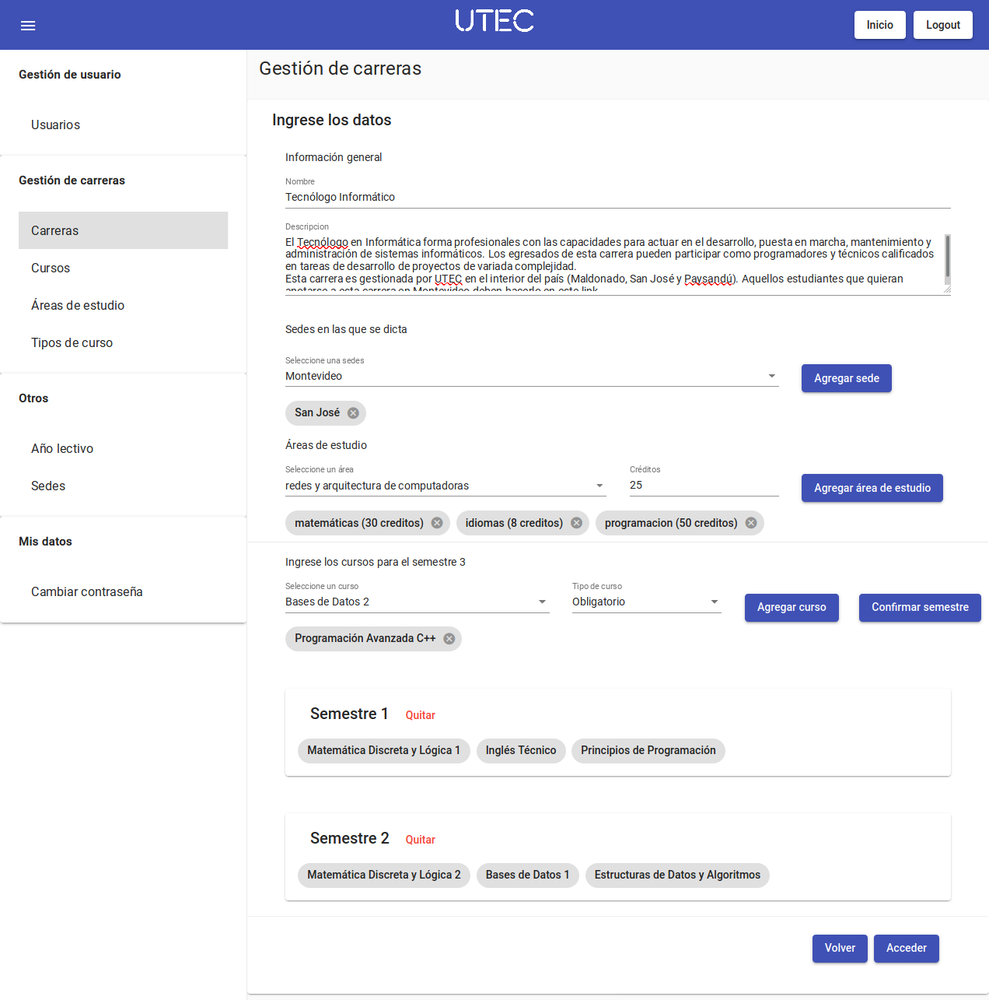
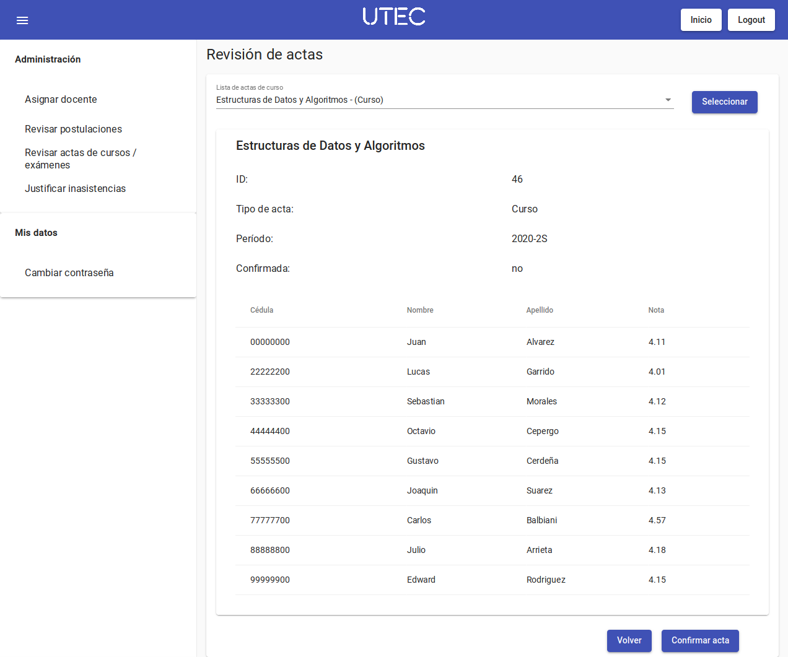
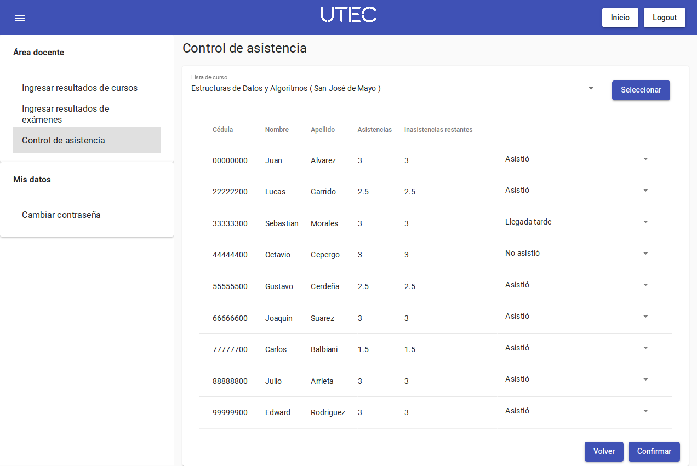
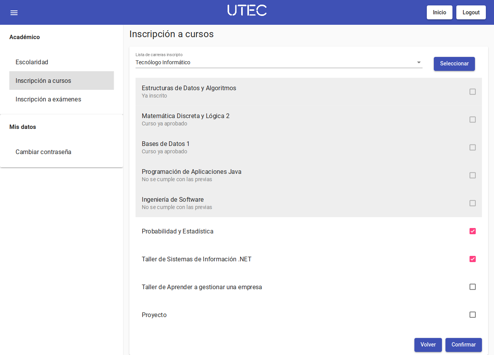
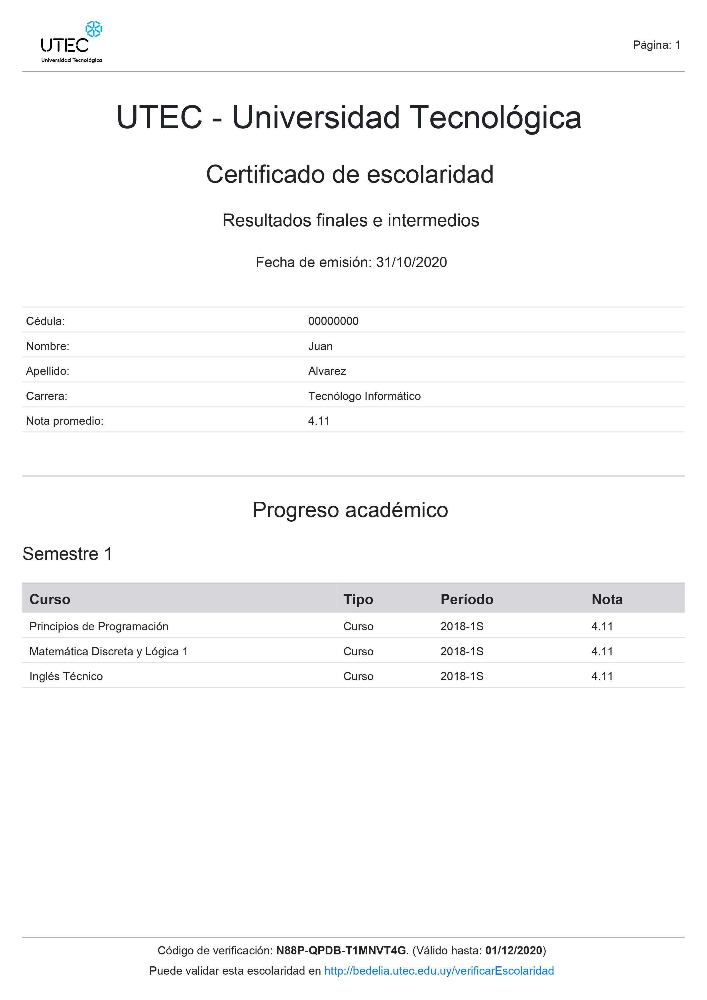
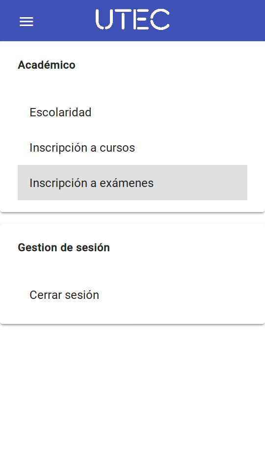
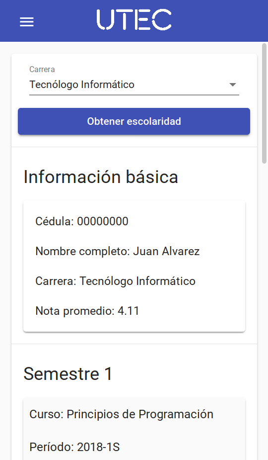
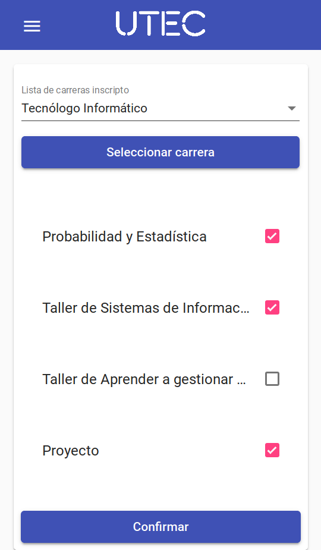

# Sistema de Bedelía

Proyecto Final - Tecnólogo en Informática

**Integrantes:**

- Juan Álvarez
- Lucas Garrido
- Sebastián Morales

## Descripción general del proyecto

Actualmente se busca modernizar el actual sistema de bedelías de UTEC para pasar a una plataforma moderna que facilite la gestión tanto a la propia universidad como a los estudiantes.

Desde el punto de vista de los requerimientos funcionales se detallan a continuación los principales:

Para más información consultar  la <a href="./documentacion/Letra.pdf">letra del proyecto</a>, el <a href="./documentacion/documento final/Documento final.pdf">documento final</a>. y sus  <a href="./documentacion/documento final/Documento final anexos.pdf">anexos</a>

## Capturas de pantalla

### Sitio web

#### Página de inicio

---

### Visualización de carrera

---

### Creación de carrera

---

### Visualización de actas

---

### Control de asistencia

---

### Inscripción a cursos

---

### Escolaridad en formato PDF

---

## Aplicación móvil

<table>
    <tr>
        <td>
            Inicio
            
        </td>
        <td>
            Menú
            
        </td>
    </tr>
    <tr>
        <td>
            Consulta de escolaridad
            
        </td>
        <td>
            Inscripción a cursos
            
        </td>
    </tr>
</table>

<!--

-->
